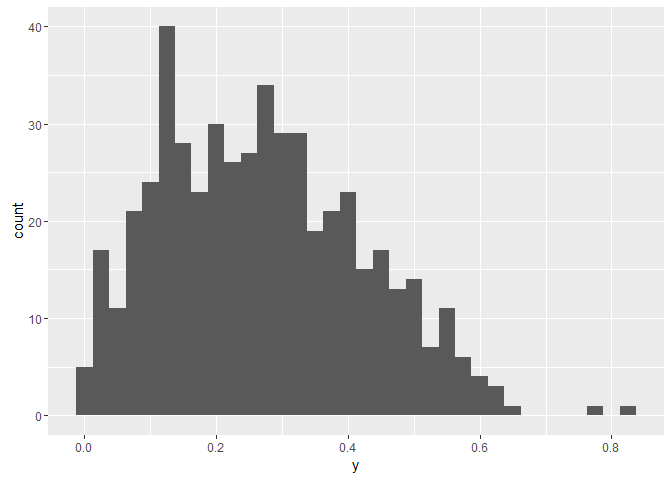

Beta Regression in Stan
================

Beta Regression in Stan
-----------------------

This is code to implement beta regression similar to the [`betareg` package](https://cran.r-project.org/web/packages/betareg/index.html) in [Stan](http://mc-stan.org/).

Simulated data
--------------

A minimal simulation model can be used to relate the value of a beta distributed random variable, `y`, to two covariates, `x1` and `x2`.

``` r
library(betareg)
library(rstan)
library(dplyr)


N = 500
x1 = rnorm(N)
x2 = rnorm(N)
X = cbind(1, x1, x2)
beta = c(-1,.2,-.3)
gamma = c(2, .25, -.5)
mu = plogis(X %*% beta)  # add noise if desired + rnorm(N, sd=.01)
phi = exp(X %*% gamma)
A = mu*phi
B = (1-mu)*phi
y = rbeta(N, A, B)

qplot(y, geom = "histogram", binwidth = .025)
```



betareg
-------

The simulated data can be fit using the `betareg` package as follow:

``` r
brmod <- betareg(y ~ x1 + x2 | x1 + x2, data = data.frame(y, X[,-1]))
summary(brmod)
```

    ## 
    ## Call:
    ## betareg(formula = y ~ x1 + x2 | x1 + x2, data = data.frame(y, X[, 
    ##     -1]))
    ## 
    ## Standardized weighted residuals 2:
    ##     Min      1Q  Median      3Q     Max 
    ## -4.3998 -0.5784  0.0593  0.6774  2.3467 
    ## 
    ## Coefficients (mean model with logit link):
    ##             Estimate Std. Error z value Pr(>|z|)    
    ## (Intercept) -1.05873    0.03716 -28.495  < 2e-16 ***
    ## x1           0.25838    0.03343   7.729 1.09e-14 ***
    ## x2          -0.30739    0.03049 -10.083  < 2e-16 ***
    ## 
    ## Phi coefficients (precision model with log link):
    ##             Estimate Std. Error z value Pr(>|z|)    
    ## (Intercept)  2.04080    0.06145  33.211  < 2e-16 ***
    ## x1           0.18170    0.06270   2.898  0.00376 ** 
    ## x2          -0.58584    0.05986  -9.786  < 2e-16 ***
    ## ---
    ## Signif. codes:  0 '***' 0.001 '**' 0.01 '*' 0.05 '.' 0.1 ' ' 1 
    ## 
    ## Type of estimator: ML (maximum likelihood)
    ## Log-likelihood: 366.3 on 6 Df
    ## Pseudo R-squared: 0.2203
    ## Number of iterations: 23 (BFGS) + 1 (Fisher scoring)

Stan
----

We can fit the same model Stan with the following code:

``` r
stan_beta <- "
data {
  int<lower=1> N;
  int<lower=1> K;
  int<lower=1> J;
  vector<lower=0,upper=1>[N] y;
  matrix[N,K] X;
  matrix[N,J] Z;
}

parameters {
  vector[K] beta;
  vector[J] gamma;
}

transformed parameters{
  vector<lower=0,upper=1>[N] mu;    // transformed linear predictor for mean of beta distribution
  vector<lower=0>[N] phi;           // transformed linear predictor for precision of beta distribution
  vector<lower=0>[N] A;             // parameter for beta distn
  vector<lower=0>[N] B;             // parameter for beta distn

  for (i in 1:N) {
    mu[i]  = inv_logit(X[i,] * beta);   
    phi[i] = exp(Z[i,] * gamma);
  }

  A = mu .* phi;
  B = (1.0 - mu) .* phi;
}

model {
  // priors

  // likelihood
  y ~ beta(A, B);
}

generated quantities{
  vector[N] log_lik;
  vector[N] log_lik_rep;
  vector<lower=0,upper=1>[N] y_rep;
  real total_log_lik;
  real total_log_lik_rep;
  
  int<lower=0, upper=1> p_omni;

  for (n in 1:N) {
    log_lik[n] = beta_lpdf(y[n] | A[n], B[n]);
    y_rep[n] = beta_rng(A[n], B[n]);
    log_lik_rep[n] = beta_lpdf(y_rep[n] | A[n], B[n]);
  }

  total_log_lik = sum(log_lik);
  total_log_lik_rep = sum(log_lik_rep);

  p_omni = (total_log_lik_rep > total_log_lik);
}
"

# Stan data list
dat = list(N = length(y), 
            K = dim(X)[2], 
            J = dim(X)[2], 
            y = y, 
            X = X, 
            Z = X)

beta_stan_test <- stan(model_code = stan_beta,
     data       = dat,
     pars       = c("beta", "gamma"))
```

Which yields the following output:

``` r
summary(beta_stan_test)$summary
```

    ##                 mean      se_mean         sd         2.5%         25%
    ## beta[1]   -1.0578794 0.0007575893 0.03608624  -1.12759651  -1.0815517
    ## beta[2]    0.2581059 0.0006553616 0.03241052   0.19501445   0.2359702
    ## beta[3]   -0.3081080 0.0006124709 0.03027841  -0.36678773  -0.3283686
    ## gamma[1]   2.0333819 0.0010891327 0.05736496   1.91889965   1.9960479
    ## gamma[2]   0.1807282 0.0012270606 0.06054601   0.06326312   0.1396756
    ## gamma[3]  -0.5823571 0.0011409566 0.05954167  -0.69159932  -0.6231347
    ## lp__     363.5091644 0.0351565363 1.62791282 359.63406528 362.6484299
    ##                  50%         75%       97.5%    n_eff      Rhat
    ## beta[1]   -1.0580193  -1.0339042  -0.9864024 2268.902 1.0000020
    ## beta[2]    0.2572134   0.2802980   0.3216711 2445.738 1.0002806
    ## beta[3]   -0.3081388  -0.2871839  -0.2488962 2443.966 1.0003315
    ## gamma[1]   2.0339171   2.0713004   2.1465796 2774.162 1.0016114
    ## gamma[2]   0.1823890   0.2207172   0.2995250 2434.664 1.0002753
    ## gamma[3]  -0.5827447  -0.5423281  -0.4673546 2723.351 0.9995771
    ## lp__     363.8145141 364.6830328 365.7126174 2144.125 1.0012037
