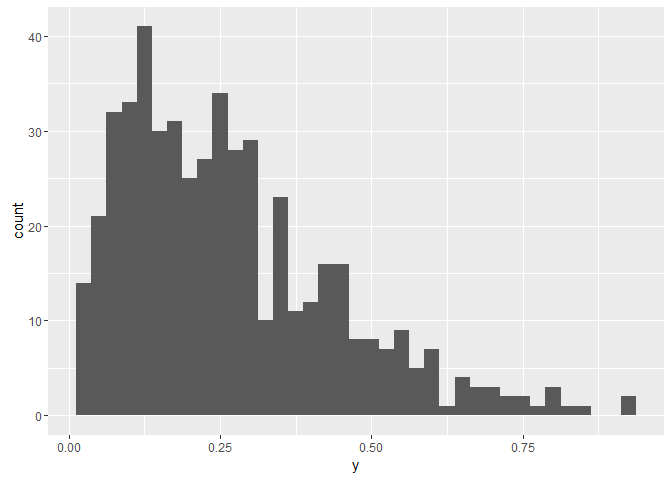

Beta Regression in Stan
================

Beta Regression in Stan
-----------------------

This is code to implement beta regression similar to the [`betareg` package](https://cran.r-project.org/web/packages/betareg/index.html) in [Stan](http://mc-stan.org/).

Simulated data
--------------

A minimal simulation model can be used to relate the value of a beta distributed random variable, `y`, to two covariates, `x1` and `x2`.

``` r
library(betareg)
library(rstan)
library(dplyr)

N = 500
x1 = rnorm(N)
x2 = rnorm(N)
X = cbind(1, x1, x2)
beta = c(-1,.2,-.3)
mu = plogis(X%*%beta)  # add noise if desired + rnorm(N, sd=.01)
phi = 10
A = mu*phi
B = (1-mu)*phi
y = rbeta(N, A, B)
qplot(y, geom = "histogram", binwidth = .025)
```



betareg
-------

The simulated data can be fit using the `betareg` package as follow:

``` r
brmod <- betareg(y ~ ., data = data.frame(y, X[,-1]))
summary(brmod)
```

    ## 
    ## Call:
    ## betareg(formula = y ~ ., data = data.frame(y, X[, -1]))
    ## 
    ## Standardized weighted residuals 2:
    ##     Min      1Q  Median      3Q     Max 
    ## -3.6621 -0.5703  0.0347  0.7317  2.5384 
    ## 
    ## Coefficients (mean model with logit link):
    ##             Estimate Std. Error z value Pr(>|z|)    
    ## (Intercept) -1.03877    0.03066 -33.881   <2e-16 ***
    ## x1           0.24226    0.02922   8.292   <2e-16 ***
    ## x2          -0.37251    0.02970 -12.544   <2e-16 ***
    ## 
    ## Phi coefficients (precision model with identity link):
    ##       Estimate Std. Error z value Pr(>|z|)    
    ## (phi)  10.3718     0.6381   16.25   <2e-16 ***
    ## ---
    ## Signif. codes:  0 '***' 0.001 '**' 0.01 '*' 0.05 '.' 0.1 ' ' 1 
    ## 
    ## Type of estimator: ML (maximum likelihood)
    ## Log-likelihood: 353.8 on 4 Df
    ## Pseudo R-squared: 0.3029
    ## Number of iterations: 12 (BFGS) + 3 (Fisher scoring)

Stan
----

We can fit the same model Stan with the following code:

``` r
stan_beta <- "
data {
  int<lower=1> N;
  int<lower=1> K;
  vector<lower=0,upper=1>[N] y;
  matrix[N,K] X;

}

parameters {
  vector[K] gamma;
  real<lower=0> phi;
}
transformed parameters{
  vector<lower=0,upper=1>[N] mu;    // transformed linear predictor
  vector<lower=0>[N] A;             // parameter for beta distn
  vector<lower=0>[N] B;             // parameter for beta distn

  for (i in 1:N)
    mu[i] = inv_logit(X[i,] * gamma);   
  A = mu * phi;
  B = (1.0 - mu) * phi;
}
model {

  // priors
  // gamma ~ normal(0, 1);   
  // phi ~ cauchy(0, 5);               // different options for phi  
  // phi ~ inv_gamma(.001, .001);
  // phi ~ uniform(0, 500);          // put upper on phi if using this
  // likelihood
  y ~ beta(A, B);

}
"
# Stan data list
dat = list(N = length(y), K=ncol(X), y=y, X=X)

beta_stan_test <- stan(model_code = stan_beta,
     data       = dat,
     pars       = c("gamma", "phi"))
```

Which yields the following output:

``` r
summary(beta_stan_test)$summary
```

    ##                 mean      se_mean         sd        2.5%         25%
    ## gamma[1]  -1.0399200 0.0006063061 0.02884446  -1.0977598  -1.0586607
    ## gamma[2]   0.2425668 0.0005165253 0.02881212   0.1839529   0.2229884
    ## gamma[3]  -0.3727148 0.0005457226 0.02868729  -0.4284929  -0.3918674
    ## phi       10.3567588 0.0120873295 0.60107470   9.2464216   9.9451109
    ## lp__     354.2984507 0.0319870707 1.33182889 350.9633669 353.6696538
    ##                  50%         75%       97.5%    n_eff      Rhat
    ## gamma[1]  -1.0396760  -1.0206071  -0.9834121 2263.295 0.9994734
    ## gamma[2]   0.2428035   0.2618348   0.2970961 3111.483 1.0012840
    ## gamma[3]  -0.3723893  -0.3537642  -0.3175180 2763.345 1.0017644
    ## phi       10.3367363  10.7655099  11.5955123 2472.841 1.0007849
    ## lp__     354.6182545 355.2764974 355.9210539 1733.596 1.0009945
